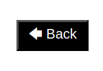

# Personal-Blog

## Description

 Personal Blog is a two-page website where users can input and view blog posts. The blog posts are created using an html form, stored in the local storage, and then dynamically displayed.

## Usage

To create a blog post, fill all of the form fields and click the submit button.

You'll be redirected to a new page where the new and all previous blog posts are displayed.

To go back to the form page, click the back button on the top right corner.

To change between themes, click the sun or moon icon on the top right corner.

## Features

- Create and view Blog Posts
- Store posts in local storage
- Toggle between light/dark mode